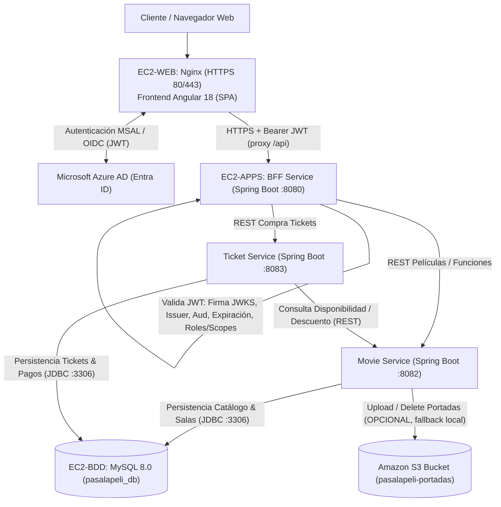

# 🧠 DOCUMENTO DE CONTEXTO TÉCNICO Y ARQUITECTURA (AI & DEVELOPER CONTEXT)
## PROYECTO: "PASA LA PELI" - PLATAFORMA CLOUD NATIVE DE CINE
*Este archivo está diseñado para ser leído por agentes de Inteligencia Artificial (Antigravity, LLMs, Copilots) y desarrolladores humanos para comprender de forma inmediata el estado, arquitectura, componentes y decisiones de diseño del proyecto.*

---

## 1. INFORMACIÓN GENERAL DEL PROYECTO
- **Nombre del Sistema:** Pasa La Peli
- **Asignatura:** Desarrollo Cloud Native I (Sigla: DSY1107)
- **Institución:** Duoc UC
- **Estudiantes / Autores:** Vicente Banderas, Martin Vergara
- **Evaluación:** Evaluación Parcial N° 1 (EP1) - Ponderación 16%
- **Ubicación del Código:** `D:\Pasa La Peli\Github\`
- **Material de Referencia Original:**
  - `Guias/EP1_DSY1107_Estudiante_encargo.pdf` (Pauta de evaluación oficial Duoc UC)
  - `Guias/Informe desarrollo cloud native.docx` (Informe técnico de diseño)
  - `Diagramas/` (7 PNG heredados OBSOLETOS + 9 `.txt` UML CORREGIDOS: `01_arquitectura_general_UML.txt`, `02_componentes_UML.txt`, `03_autenticacion_UML.txt`, `04_compra_ticket_UML.txt`, `05_base_datos_UML.txt`, `06_despliegue_UML.txt`, `07_s3_UML.txt`, `08_patrones_UML.txt`, `09_admin_peliculas_UML.txt`)

---

## 2. ARQUITECTURA GLOBAL Y MULTI-CLOUD

La plataforma utiliza una arquitectura distribuida de microservicios sobre **Microsoft Azure** y **Amazon Web Services (AWS)**:



> **NOTA:** **No existe AWS API Gateway.** El entrypoint real de la API es el **BFF** detrás del **proxy `/api` de Nginx** (EC2-WEB → EC2-APPS:8080). Cualquier diagrama o texto que muestre API Gateway como componente operativo está desactualizado.

---

## 3. MAPEO DE MICROSERVICIOS Y PUERTOS

| Componente | Carpeta | Tecnología | Puerto | Responsabilidad Principal |
| :--- | :--- | :--- | :---: | :--- |
| **Frontend** | `frontend/` | Angular 18, MSAL Browser/Angular | `4200` (dev) / `80/443` (prod, nginx en EC2-WEB) | Interfaz de usuario, cartelera, selección de horarios, modal de compra con manejo de HTTP 409, panel de administración con subida de archivos e integración MSAL. Se sirve estático por Nginx en **EC2-WEB**, con proxy `/api` → EC2-APPS:8080. |
| **BFF Service** | `bff-service/` | Java 21, Spring Boot 3.3, Spring Security OAuth2 | `8080` | Valida técnicamente el JWT (firma JWKS, vigencia, emisor, audiencia, roles) y expone APIs agregadas hacia el frontend. |
| **Movie Service**| `movie-service/`| Java 21, Spring Boot 3.3, Spring Data JPA, AWS SDK v2 | `8082` | Gestión de `Pelicula` y `Funcion`. Sube portadas a Amazon S3 (`/peliculas/<uuid>.jpg`). Control de concurrencia pesimista en cupos. |
| **Ticket Service**| `ticket-service/`| Java 21, Spring Boot 3.3, Spring Data JPA | `8083` | Orquestador del flujo de compra: valida stock en tiempo real con Movie Service, procesa pago simulado (`Pago`), emite `Ticket`, descuenta stock y retorna **HTTP 409 Conflict** si no hay cupos. |
| **Base de Datos**| `database/` | MySQL 8.0 (`pasalapeli_db`) | `3306` | Persistencia relacional de 5 tablas (`Usuario`, `Pelicula`, `Funcion`, `Ticket`, `Pago`). Script inicial: `database/init.sql`. Corre **nativo en EC2-BDD** (no es contenedor) y es accesible por JDBC desde EC2-APPS. |

---

## 4. ESQUEMA DE BASE DE DATOS (`pasalapeli_db`)

El modelo cumple con `Diagramas/Diagrama BDD.png`:

1. **`Usuario`**:
   - `id`: BIGINT PK AUTO_INCREMENT
   - `nombre`: VARCHAR(100)
   - `correo`: VARCHAR(100) UNIQUE
   - `password`: VARCHAR(255)
   - `rol`: ENUM('ADMIN', 'CLIENTE')

2. **`Pelicula`**:
   - `id`: BIGINT PK AUTO_INCREMENT
   - `titulo`: VARCHAR(100)
   - `descripcion`: TEXT
   - `genero`: VARCHAR(50)
   - `duracion`: INT (minutos)
   - `clasificacion`: VARCHAR(10)
   - `imagen`: VARCHAR(255) (URL de Amazon S3 o fallback local)

3. **`Funcion`**:
   - `id`: BIGINT PK AUTO_INCREMENT
   - `fecha`: DATE
   - `hora`: TIME
   - `sala`: VARCHAR(20)
   - `entradas_disponibles`: INT
   - `precio`: DECIMAL(10,2)
   - `pelicula_id`: BIGINT FK -> `Pelicula(id)` (ON DELETE CASCADE)

4. **`Ticket`**:
   - `id`: BIGINT PK AUTO_INCREMENT
   - `fecha_compra`: DATETIME
   - `codigo`: VARCHAR(100) UNIQUE (ej. `PLP-2026-XXXX`)
   - `estado`: ENUM('PENDIENTE', 'PAGADO', 'CANCELADO')
   - `usuario_id`: BIGINT FK -> `Usuario(id)`
   - `funcion_id`: BIGINT FK -> `Funcion(id)`
   - `cantidad`: INT (entradas por ticket, DEFAULT 1)

5. **`Pago`**:
   - `id`: BIGINT PK AUTO_INCREMENT
   - `monto`: DECIMAL(10,2)
   - `metodo`: VARCHAR(30) (ej. 'WEBPAY', 'TARJETA_CREDITO')
   - `estado`: ENUM('PENDIENTE', 'APROBADO', 'RECHAZADO')
   - `fecha_pago`: DATETIME
   - `ticket_id`: BIGINT FK -> `Ticket(id)` (ON DELETE CASCADE)

---

## 5. FLUJOS DE NEGOCIO CLAVE IMPLEMENTADOS

### Flujo 1: Autenticación con Azure AD y Validación en BFF (Diagrama Auth.png)
1. Angular utiliza la librería `@azure/msal-browser` y `@azure/msal-angular` para autenticar al usuario contra Microsoft Entra ID (Azure AD).
2. Se obtiene un token JWT válido.
3. El `MsalInterceptor` inyecta automáticamente la cabecera `Authorization: Bearer <JWT>` en las peticiones hacia el BFF (a través del proxy `/api` de Nginx en EC2-WEB).
4. El **BFF** valida de forma estricta:
   - **Issuer:** Verifica que el emisor sea el inquilino configurado (`azure.activedirectory.tenant-id`).
   - **Audience:** La clase `AudienceValidator` valida que el `aud` del token coincida con el Client ID o App ID URI registrado.
   - **Firma criptográfica:** Consulta el endpoint JWKS público de Microsoft (`/discovery/v2.0/keys`).
   - **Vigencia:** Valida expiración y marcas temporales con `JwtTimestampValidator`.
   - **Roles y Scopes:** La clase `JwtAuthConverter` extrae los claims `roles` o `scp` para asignar permisos `ROLE_ADMIN` o `ROLE_CLIENTE`.
   - *Modo Desarrollo:* Se incluye `DevMockAuthFilter` que permite simular la identidad mediante cabeceras `X-Dev-User-Role` y `X-Dev-User-Email` cuando no se dispone de una suscripción activa de Azure AD.
   - **La validación del JWT la hace EXCLUSIVAMENTE el BFF; Nginx (reverse-proxy) no valida tokens.**

### Flujo 2: Compra y Validación de Tickets con HTTP 409 (Diagarma Tickets.png)
1. El usuario selecciona una película y una función en Angular.
2. Angular llama a `POST /api/tickets/comprar` enviando `usuarioId`, `funcionId`, `cantidad` y `metodoPago`.
3. El **BFF** reenvía la petición al **Ticket Service**.
4. El **Ticket Service** consulta a **Movie Service** (`GET /api/funciones/{id}/disponibilidad`).
5. **Evaluación de Disponibilidad:**
   - **Caso Positivo (Hay cupo):** 
     - Se descuenta el stock en Movie Service (`PUT /api/funciones/{id}/descontar`) usando bloqueo pesimista `SELECT ... FOR UPDATE`.
     - Se crea el registro `Ticket` con código único y estado `PAGADO`.
     - Se simula y almacena la transacción en la tabla `Pago` con estado `APROBADO`.
     - Se retorna el ticket digital al cliente con HTTP 201 Created.
   - **Caso Negativo (Sin cupo):**
     - Se lanza `InsufficientTicketsException`.
     - El `GlobalExceptionHandler` intercepta la excepción y retorna un código de error **HTTP 409 Conflict** (según rúbrica oficial de la evaluación).
     - El frontend muestra una alerta visual destacando el conflicto 409 y ofreciendo recargar la cartelera.

### Flujo 3: Carga de Portadas a Amazon S3 (Diagrama específico de S3.png)
1. El administrador accede a `/admin` en Angular.
2. Completa el formulario de película y adjunta el archivo de imagen de la portada.
3. Se envía mediante `multipart/form-data` al endpoint `/api/admin/movies` del BFF, el cual lo canaliza a Movie Service.
4. `S3StorageService` utiliza el cliente de AWS SDK v2 (`S3Client`) para ejecutar un `PutObjectRequest` hacia el bucket de Amazon S3 (`pasalapeli-portadas`).
5. Si las credenciales de AWS no están activadas (`aws.s3.enabled: false`), se activa automáticamente el mecanismo de respaldo local guardando la imagen en `uploads/peliculas` y exponiéndola como recurso estático HTTP sin que la aplicación falle.
6. La URL pública devuelta se almacena en el campo `imagen` de la tabla `Pelicula`.

### Flujo 4: Checkout simulado con tarjeta y registro automático de usuario (11/09/2026)
1. En la modal de compra, el usuario completa el paso "Detalle" (cantidad + método) y presiona **"Continuar al Pago"**.
2. Se muestra un paso "Pago Simulado": tarjeta visual, campos de titular, número (16 dígitos formateados 4-4-4-4), vencimiento MM/AA y CVV. Validación client-side y aviso de que el pago es 100% simulado (puede usarse 4242 4242 4242 4242).
3. **"Confirmar Pago y Emitir Ticket"** simula el procesamiento con el gateway (spinner 1.2 s) e invoca `POST /api/tickets/comprar` como antes (Ticket Service crea `Pago` con estado `APROBADO` automáticamente). No hay backend de pagos externo.
4. **Identidad real del usuario:** en modo Azure, `AuthService.sincronizarPerfilConBFF()` consulta `GET /api/auth/me` del BFF tras el login; el BFF llama `POST /api/usuarios/ensure` en Ticket Service (find-or-create por correo en la tabla `Usuario`, rol `CLIENTE`) y devuelve el `id` real, reemplazando el antiguo `id: 2` fijo para todos.
5. Fallback: si Ticket Service no responde, el BFF conserva el mapeo demo (ADMIN=1, resto=2).
6. Fix adicional del build: `AuthService.login()` ya no hace spread sobre `msalGuardConfig.authRequest` (no era asignable a `RedirectRequest` — TypeScript exigía `scopes`); ahora pasa el `authRequest` tal cual (ya trae `scopes` desde `msal.config.ts`).

### Flujo 5: Arquitectura real - SIN AWS API Gateway (11/09/2026)
1. El punto de entrada de la API es el **BFF (Spring Boot :8080)** alojado en **EC2-APPS**.
2. El **Nginx** del frontend (**EC2-WEB**) redirige las rutas `/api/*` a `http://<EC2_APPS_HOST>:8080` mediante `proxy_pass` (ver `frontend/nginx.conf`). **No existe AWS API Gateway** en el código, en Docker, ni en el despliegue.
3. En la guía original se contemplaba API Gateway, pero la decisión de sesión (sección 9.10) lo eliminó a favor del reverse-proxy de Nginx. Cualquier diagrama o texto que muestre API Gateway como componente operativo está desactualizado.
4. Lo mismo aplica a patrones: NO se implementa Factory Method ni Circuit Breaker ni Retry. Se implementan sus equivalentes ligeros: lock pesimista, timeouts de RestTemplate, fallbacks locales y manejo central de excepciones (ver `Diagramas/08_patrones_UML.txt`).

---

## 6. INVENTARIO COMPLETO DE ARCHIVOS CREADOS

### Base de Datos (`Github/database/`) — Repo orquestador `pasalapeli-database`
- `init.sql`: Creación del esquema `pasalapeli_db`, tablas con llaves foráneas, índices y datos iniciales de prueba (usuarios, películas, funciones, tickets y pagos).
- `docker-compose.yml`: Stack backend para **EC2-APPS** (bff 8080, movie 8082, ticket 8083) apuntando a una **BDD externa** via `SPRING_DATASOURCE_URL` (topología 3 EC2). **No** contiene los servicios `mysql` ni `frontend`.
- `docker-compose.web.yml`: Stack **EC2-WEB** con SOLO el frontend (nginx, puertos 80/443, certs montados desde `./certs`). Build args: `AZURE_CLIENT_ID`, `AZURE_TENANT_ID`, `APP_BASE_URL`, `EC2_APPS_HOST`.
- `.env.example`: Plantilla de variables del stack (incluye `SPRING_DATASOURCE_URL` y `CORS_ALLOWED_ORIGINS` para BDD externa).
- `.github/workflows/bootstrap.yml`: Setup desde cero de EC2-APPS (Docker, repos, `.env`, `docker compose up --build`).
- `scripts/bootstrap-ec2.sh`: Script de bootstrap que genera el `.env` del stack.
- `scripts/renew-certs.sh`: Renovación automática de certificados Let's Encrypt.

### Movie Service (`Github/movie-service/`)
- `pom.xml`: Dependencias Spring Web, Data JPA, MySQL Connector, Validation, AWS SDK v2 S3, Lombok.
- `src/main/resources/application.yml`: Configuración de base de datos, puerto 8082, propiedades S3 y almacenamiento local.
- `.gitignore`: Ignora `target/`, carpetas de IDE y `uploads/`.
- `Dockerfile`: Compilación y empaquetado contenedor multi-stage en Java 21 Alpine.
- `src/main/java/com/pasalapeli/movie/`:
  - `MovieServiceApplication.java`: Clase principal Spring Boot.
  - `entity/Pelicula.java` & `entity/Funcion.java`: Entidades JPA mapeadas a las tablas MySQL.
  - `dto/`: `PeliculaDTO.java`, `PeliculaRequestDTO.java`, `FuncionDTO.java`, `FuncionRequestDTO.java`, `DisponibilidadDTO.java`.
  - `repository/PeliculaRepository.java` & `FuncionRepository.java`: Consultas JPQL y bloqueo pesimista `findByIdForUpdate`.
  - `config/AwsS3Config.java`: Configuración del cliente `S3Client` de AWS SDK v2.
  - `config/WebMvcConfig.java`: Configuración de CORS y mapeo estático de `/uploads/**`.
  - `service/S3StorageService.java`: Subida y eliminación en Amazon S3 con fallback local seguro.
  - `service/PeliculaService.java`: CRUD de películas y gestión de portadas.
  - `service/FuncionService.java`: Programación de funciones, consulta de stock y descuento atómico.
  - `controller/PeliculaController.java` (`/api/movies`): Endpoints de películas y subida de archivos.
  - `controller/FuncionController.java` (`/api/funciones`): Endpoints de funciones y disponibilidad.
  - `exception/`: `ResourceNotFoundException.java`, `InsufficientTicketsException.java` (409 Conflict), `ErrorResponse.java`, `GlobalExceptionHandler.java`.
  - `test/MovieServiceApplicationTests.java`: Pruebas de contexto.

### Ticket Service (`Github/ticket-service/`)
- `pom.xml`: Dependencias Spring Web, Data JPA, MySQL Connector, Validation, Lombok.
- `src/main/resources/application.yml`: Configuración de base de datos, puerto 8083 y URL de `movie-service`.
- `.gitignore`: Ignora compilados y artefactos.
- `Dockerfile`: Contenedor Java 21 Alpine.
- `src/main/java/com/pasalapeli/ticket/`:
  - `TicketServiceApplication.java`: Clase principal Spring Boot.
  - `entity/`: `Usuario.java`, `Ticket.java`, `Pago.java`, `EstadoTicket.java`, `EstadoPago.java`, `RolUsuario.java`.
  - `dto/`: `ComprarTicketRequestDTO.java`, `TicketResponseDTO.java`, `PagoDTO.java`, `DisponibilidadResponseDTO.java`.
  - `repository/`: `TicketRepository.java`, `PagoRepository.java`, `UsuarioRepository.java`.
  - `config/RestClientConfig.java`: Configuración de `RestTemplate` con timeouts de red.
  - `client/MovieServiceClient.java`: Cliente HTTP REST para consultar y descontar cupos en `movie-service`.
  - `service/TicketService.java`: Lógica de compra transaccional, simulación de pago, emisión de código y descuento de inventario.
  - `controller/TicketController.java` (`/api/tickets`): Endpoints `/comprar`, `/{id}`, `/codigo/{codigo}`, `/usuario/{usuarioId}`.
  - `exception/`: `ResourceNotFoundException.java`, `InsufficientTicketsException.java`, `ErrorResponse.java`, `GlobalExceptionHandler.java`.
  - `test/TicketServiceApplicationTests.java`: Pruebas de integración base.

### BFF Service (`Github/bff-service/`)
- `pom.xml`: Dependencias Spring Web, Spring Security, OAuth2 Resource Server, Validation, Lombok.
- `src/main/resources/application.yml`: Puerto 8080, endpoints de Azure AD y downstream de microservicios.
- `.gitignore`: Reglas de exclusión estándar.
- `Dockerfile`: Contenedor Java 21 Alpine.
- `src/main/java/com/pasalapeli/bff/`:
  - `BffServiceApplication.java`: Punto de entrada del microservicio orquestador.
  - `config/AudienceValidator.java`: Validador de claim `aud` para Azure AD.
  - `config/JwtAuthConverter.java`: Mapeador de claims `roles` y `scp` a `GrantedAuthority`.
  - `config/DevMockAuthFilter.java`: Filtro de soporte para testing y emulación de identidades.
  - `config/SecurityConfig.java`: Configuración de `SecurityFilterChain`, `JwtDecoder` con Nimbus, rutas públicas y protegidas.
  - `config/WebClientConfig.java`: Configuración de `RestTemplate` para llamadas proxy.
  - `dto/UserProfileDTO.java`: DTO de perfil autenticado.
  - `client/MovieClient.java`: Proxy de llamadas al catálogo de películas.
  - `client/TicketClient.java`: Proxy de transacciones de compra de tickets.
  - `controller/AuthController.java` (`/api/auth`): `/me` y `/login-info`.
  - `controller/CarteleraBffController.java` (`/api/cartelera`): Catálogo público de películas y funciones.
  - `controller/TicketBffController.java` (`/api/tickets`): Compra y consulta de tickets autenticados.
  - `controller/AdminBffController.java` (`/api/admin`): Creación de películas, carga de portadas (S3) y funciones bajo rol ADMIN.
  - `exception/GlobalExceptionHandler.java`: Manejo centralizado de respuestas de error.

### Frontend Angular (`Github/frontend/`)
- `package.json`: Angular 18, `@azure/msal-browser`, `@azure/msal-angular`, TypeScript 5.5.
- `angular.json`, `tsconfig.json`, `tsconfig.app.json`: Configuración de compilación moderna.
- `.gitignore`: Ignora `node_modules/`, `dist/`, `.angular/cache/`.
- `Dockerfile` & `nginx.conf`: Despliegue listo para producción con Nginx como servidor estático y reverse-proxy.
- `src/index.html` & `src/styles.css`: Maquetación estética temática de cine oscuro con colores rojo carmesí, dorado y azul cian.
- `src/environments/`: `environment.ts` y `environment.prod.ts` con parámetros para Azure AD y APIs.
- `src/app/`:
  - `services/msal.config.ts`: Factorías de configuración para `MSALInstance`, `MsalGuard` y `MsalInterceptor`.
  - `services/auth.service.ts`: Servicio unificado de autenticación con soporte para Azure AD y switch local de roles Demo.
  - `services/cartelera.service.ts`: Cliente de consumo de cartelera.
  - `services/ticket.service.ts`: Cliente de compra de tickets.
  - `services/admin.service.ts`: Cliente de administración y envío multipart de imágenes a S3.
  - `guards/auth.guard.ts` & `guards/admin.guard.ts`: Protección de rutas en el cliente.
  - `components/navbar/`: Barra de navegación con logo, menú, botón de Azure AD, badge de usuario y selector de roles demo.
  - `components/cartelera/`: Vista principal de películas en cartelera con buscador en vivo y fichas de estreno.
  - `components/pelicula-detalle/`: Vista detallada de película, horarios, salas y cupos en tiempo real.
  - `components/compra-ticket/`: Modal reactivo de selección de entradas, cálculo de precio, simulación de pago, manejo visual de **HTTP 409 Conflict** y emisión de ticket digital con código de barras simulado.
  - `components/mis-tickets/`: Historial de entradas compradas por el usuario autenticado.
  - `components/admin/`: Panel de gestión con formulario de carga de portada a Amazon S3 y programación de funciones en sala.
  - `app.component.*`, `app.routes.ts`, `app.config.ts`, `main.ts`: Estructura principal Standalone de Angular 18.

### Nota sobre la estructura de repos (monorepo superado)
Cada componente vive en su propio repo de GitHub (ver sección 9.2). La carpeta local `Github/` contiene los 5 working trees independientes:
- `database/` (orquestador), `frontend/`, `bff-service/`, `movie-service/`, `ticket-service/`.
- No existe un `docker-compose.yml` a nivel de `Github/`; los compose viven en `Github/database/` (`docker-compose.yml` para EC2-APPS y `docker-compose.web.yml` para EC2-WEB).

---

## 7. CÓMO EJECUTAR EL PROYECTO

### Ejecución Todo-en-Uno (Docker Compose, topología 3 EC2):
Los compose viven en `Github/database/` y referencian los repos hermanos como contexto de build (clonarlos como carpetas hermanas al clonar, o ajustar `build.context`). En EC2:

- **EC2-APPS** (backend): `docker compose up -d --build` desde `Github/database/` con `.env` configurado (`SPRING_DATASOURCE_URL` → `jdbc:mysql://<IP_BDD>:3306/...`).
- **EC2-WEB** (frontend): `docker compose -f docker-compose.web.yml up -d --build` desde `Github/database/` (puertos 80/443, certs en `Github/database/certs/`).

Para **desarrollo local**: levantar un MySQL (Docker o nativo), importar `database/init.sql` y exportar `SPRING_DATASOURCE_URL` (apuntando a localhost) antes de `docker compose up`.

- **Frontend:** `http://localhost:80`
- **BFF:** `http://localhost:8080`
- **Movie Service:** `http://localhost:8082`
- **Ticket Service:** `http://localhost:8083`
- **MySQL (local):** `localhost:3306` (Usuario: `root`, Password: `root`, DB: `pasalapeli_db`)

### Ejecución en Modo Local / Desarrollo:
0. **Base de Datos (opcional con Docker):** `docker run -d -p 3306:3306 -e MYSQL_ROOT_PASSWORD=root -e MYSQL_DATABASE=pasalapeli_db mysql:8` y luego importar `database/init.sql`.
1. **Base de Datos:** Importar `database/init.sql` en MySQL.
2. **Movie Service:** `cd movie-service && mvn spring-boot:run`
3. **Ticket Service:** `cd ticket-service && mvn spring-boot:run`
4. **BFF Service:** `cd bff-service && mvn spring-boot:run`
5. **Frontend:** `cd frontend && npm install && npm start` -> Abrir `http://localhost:4200`

---

## 8. INSTRUCCIONES PARA AGENTES DE IA FUTUROS
- Al agregar nuevas funcionalidades, **respeta los límites de dominio de cada microservicio**. No mezcles la lógica de pagos o tickets dentro de `movie-service`, ni la lógica de películas en `ticket-service`.
- Mantén siempre el retorno explícito del código **HTTP 409 Conflict** en `ticket-service` y en el `GlobalExceptionHandler` cuando se intenten comprar más entradas de las disponibles. Es un criterio crítico evaluado en la rúbrica.
- Cuando habilites Azure AD en producción, actualiza los valores `enabled: true`, `clientId` y `tenantId` en `frontend/src/environments/environment.ts` y en `bff-service/src/main/resources/application.yml`.
- R1: Prohibido presentar "AWS API Gateway" como componente implementado. El entrypoint real es el BFF tras Nginx.
- R2: Prohibido presentar Factory Method / Circuit Breaker / Retry como implementados. Si la rúbrica los exige, etiquetarlos siempre como "ARQUITECTURA PROPUESTA".
- R3: Si se modifica la arquitectura, actualizar SIEMPRE los `.txt` en `Diagramas/` (fuente de verdad) y el presente `PROJECT_CONTEXT.md` en el maestro y en las 5 copias.
- R4: El campo de BD para la portada se llama `imagen`. Nunca usar `imagen_url`.
- Para cualquier duda o requerimiento técnico adicional, consulta este documento (`PROJECT_CONTEXT.md`) y el archivo de especificación oficial en `Guias/Informe desarrollo cloud native.docx`.

---

## 9. PLAN DE CI/CD Y DESPLIEGUE A NUBE (ACUERDOS DE SESIÓN)

> **Propósito:** Documentar las decisiones acordadas para que cualquier agente de IA o desarrollador retome el trabajo sin depender de conversaciones anteriores.

### 9.1 Decisiones arquitectónicas de despliegue

| Decisión | Valor acordado |
| :--- | :--- |
| Estructura de repos | **Monorepo descartado.** Cada componente es un **repo de GitHub independiente y público** |
| Despliegue | **Directo a una instancia EC2 (Ubuntu 24.04) vía SSH desde GitHub Actions** |
| Registro de imágenes | **Ninguno (no ECR/ACR).** Las imágenes se construyen en el propio EC2 (`git pull` + `docker compose up -d --build`) |
| Orquestación en EC2 | Docker Compose en `/opt/pasalapeli/`; el repo `pasalapeli-database` actúa como **orquestador** (contiene `docker-compose.yml` + `.env`) |
| Microsoft Azure AD | **Modo real en producción** (`AZURE_AUTH_ENABLED=true`), con `issuer-uri` al tenant específico (NUNCA `/common/` en prod) |
| HTTPS | **Obligatorio** porque Azure AD exige redirect URIs HTTPS fuera de localhost. Se usa **Let's Encrypt (certbot)** con dominio propio apuntando al EC2 |
| EC2 | **Desde cero**: el workflow `bootstrap.yml` instala Docker, clona los repos y levanta el stack completo |

### 9.2 Repositorios en GitHub (todos públicos)

| Repo GitHub | Carpeta local | Rol |
| :--- | :--- | :--- |
| `pasalapeli-database` | `Github/database/` | **Orquestador**: `init.sql`, `docker-compose.yml`, `.env.example`, workflow `bootstrap.yml` |
| `pasalapeli-frontend` | `Github/frontend/` | Imagen del frontend Angular (nginx, HTTPS) |
| `pasalapeli-bff-service` | `Github/bff-service/` | Imagen del BFF (Spring Boot 8080) |
| `pasalapeli-movie-service` | `Github/movie-service/` | Imagen del Movie Service (Spring Boot 8082) |
| `pasalapeli-ticket-service` | `Github/ticket-service/` | Imagen del Ticket Service (Spring Boot 8083) |

### 9.3 Layout en EC2 - TOPOLOGÍA 3 EC2 (actual)

```
EC2-BDD:  MySQL 8 nativo + database/init.sql (sin Docker)
EC2-APPS: /opt/pasalapeli/ con los CLONES de:
            pasalapeli-database/  (docker-compose.yml + .env)
            pasalapeli-bff-service/
            pasalapeli-movie-service/
            pasalapeli-ticket-service/
          docker compose up -d --build (bff/movie/ticket)
EC2-WEB:  /opt/pasalapeli/ con:
            pasalapeli-database/  (docker-compose.web.yml + .env)
            pasalapeli-frontend/
            certs/ (Let's Encrypt) montados en el contenedor nginx
          docker compose -f docker-compose.web.yml up -d --build
```

Los `build.context` de los compose usan rutas relativas `../pasalapeli-*` porque los repos se clonan como hermanos (`pasalapeli-database` actúa como orquestador).

### 9.4 Workflows de GitHub Actions

| Repo | Workflow | Trigger | Acción |
| :--- | :--- | :--- | :--- |
| `pasalapeli-database` | `.github/workflows/bootstrap.yml` | push `main` | Setup EC2 desde cero (instalar Docker/certbot, clonar 4 repos, emitir/renovar certs, `docker compose up -d --build`) |
| `frontend` | `.github/workflows/deploy.yml` | push `main` | `git pull` → `docker compose -f docker-compose.web.yml up -d --build frontend` → checklist de salud |
| `bff-service` | `.github/workflows/deploy.yml` | push `main` | Ídem para `bff-service` |
| `movie-service` | `.github/workflows/deploy.yml` | push `main` | Ídem para `movie-service` |
| `ticket-service` | `.github/workflows/deploy.yml` | push `main` | Ídem para `ticket-service` |

Todos usan [`appleboy/ssh-action`](https://github.com/appleboy/ssh-action) con la clave privada en `secrets.EC2_SSH_KEY`.

### 9.5 Secrets y Variables requeridos en GitHub

**Secrets (crear en los 5 repos:** Settings → Secrets and variables → Actions → New repository secret):

| Secret | Descripción |
| :--- | :--- |
| `EC2_HOST` | IP pública o dominio del EC2 |
| `EC2_USER` | Usuario SSH (normalmente `ubuntu`) |
| `EC2_SSH_KEY` | Clave privada SSH (pem) |

**Variables de GitHub (repo `pasalapeli-database` y `pasalapeli-frontend`):**

| Variable | Description | Dónde |
| :--- | :--- | :--- |
| `EC2_DOMAIN` | Dominio propio (ej. `peli.midominio.cl`). Si es vacío → bootstrap en modo pruebas (self-signed + CORS `*`) | database, frontend |
| `CERTBOT_EMAIL` | Email para Let's Encrypt | database |
| `EC2_APPS_HOST` | IP pública o DNS del EC2-APPS (backend). Obligatorio en topología 3 EC2; sin ella el frontend proxy'ía a `bff-service` (single-EC2) | frontend |

**Secrets opcionales (repo `pasalapeli-database`) para el `.env` del stack** — **con fallback a defaults** definidos en `bootstrap.yml`, así que el bootstrap funciona sin configurarlos:

| Secret | Fallback |
| :--- | :--- |
| `MYSQL_ROOT_PASSWORD` | `root` |
| `SPRING_DATASOURCE_USERNAME` / `SPRING_DATASOURCE_PASSWORD` | `root` / `root` |
| `AZURE_AUTH_ENABLED` | `false` |
| `AZURE_CLIENT_ID` / `AZURE_TENANT_ID` / `AZURE_APP_ID_URI` | vacío |
| `AZURE_AD_ISSUER_URI` / `AZURE_AD_JWK_SET_URI` | vacío |
| `AWS_ACCESS_KEY_ID` / `AWS_SECRET_ACCESS_KEY` | vacío |

Variables opcionales: `AWS_S3_ENABLED`, `AWS_S3_BUCKET`, `AWS_REGION`.

**Regla de oro:** ningún secret hardcodeado en el código. Todos viajan por variables de entorno (`.env` en EC2) o GitHub Secrets/Variables.

### 9.6 Variables de entorno del stack (`.env` en EC2)

- `MYSQL_ROOT_PASSWORD=root` (o valor producido)
- `SPRING_DATASOURCE_URL=jdbc:mysql://mysql:3306/pasalapeli_db?...` → valor real en producción: `jdbc:mysql://<IP_BDD>:3306/pasalapeli_db?...` (EC2-BDD)
- `SPRING_DATASOURCE_USERNAME` / `SPRING_DATASOURCE_PASSWORD`
- `MOVIE_SERVICE_URL=http://movie-service:8082`
- `TICKET_SERVICE_URL=http://ticket-service:8083`
- `AZURE_AUTH_ENABLED=true`
- `AZURE_CLIENT_ID` / `AZURE_TENANT_ID` / `AZURE_APP_ID_URI`
- `AZURE_AD_ISSUER_URI=https://login.microsoftonline.com/<tenant-id>/v2.0`
- `AZURE_AD_JWK_SET_URI=https://login.microsoftonline.com/<tenant-id>/discovery/v2.0/keys`
- `AWS_S3_ENABLED=true` (si se usan credenciales estáticas) / `AWS_S3_BUCKET` / `AWS_REGION` / `AWS_ACCESS_KEY_ID` / `AWS_SECRET_ACCESS_KEY`
- `CORS_ALLOWED_ORIGINS=https://<dominio>`

### 9.7 Cambios preparados en el código (estado)

- **Actuator**: agregado `spring-boot-starter-actuator` a `bff-service`, `movie-service` y `ticket-service` + `HEALTHCHECK` en sus `Dockerfile` sobre `/actuator/health`.
- **`.dockerignore`**: creado en los 4 repos de aplicación (excluye `target/`, `node_modules/`, `.git/`, IDE).
- **`init.sql`**: reescrito — la versión original tenía los identificadores corruptos (backslashes que comían caracteres, ej. `\ombre\` en vez de `` `nombre` ``; no ejecutaba en MySQL).
- **Frontend**: `environment.prod.ts` con placeholders reemplazados en build vía `ARG` de Docker; `nginx.conf` con HTTPS (puerto 443 + redirect de 80), certificados montados en `/etc/nginx/certs/`.
- **BFF**: CORS configurable vía `CORS_ALLOWED_ORIGINS` (reemplaza el `*` fijo); `Azure AD real` por env vars ya implementado (`AZURE_AUTH_ENABLED`, `AZURE_CLIENT_ID`, `AZURE_TENANT_ID`).

### 9.7.1 Revisión de código del deploy (HECHO - bugs corregidos)

1. `frontend/src/environments/environment.prod.ts`: comentarios con `#` (sintaxis inválida en TS) → reemplazados por `//`. Roto habría tumbado `ng build`.
2. `bff-service SecurityConfig.java`: `/actuator/health` quedaba tras `anyRequest().authenticated()` → el HEALTHCHECK de Docker nunca llegaba a `healthy`. Ahora `/actuator/health**` e `/actuator/info` son `permitAll()`.
3. `bootstrap-ec2.sh`: el `nginx` de apt se auto-iniciaba y ocupaba 80/443 → certbot `--standalone` fallaba. Ahora se `systemctl stop/disable nginx` antes de emitir certificados.
4. Modo pruebas sin dominio: antes generaba `CORS_ALLOWED_ORIGINS=https://` y `APP_BASE_URL=https://` (rotos). Ahora test-mode ⇒ `*` y `https://localhost` (en `bootstrap.yml` y en el script).
5. `bootstrap.yml`: las variables listadas en `envs:` NUNCA se definían en el workflow ⇒ se enviaban vacías. Ahora hay un bloque `env:` en el step con Secrets de GitHub + fallbacks (root/root, AZURE false, AWS false), por lo que el bootstrap funciona sin configurar ningún secret extra.
6. Los 4 `deploy.yml` ahora **fallan (exit 1)** si el contenedor no queda `healthy` a los 150 s (antes terminaban en OK con el servicio caído).

### 9.8 Tareas manuales pendientes (fuera del código)

1. ✅ **HECHO** — Crear los 5 repos públicos en GitHub y subir cada carpeta local (repos de `vicebande`, branch `main`, origin configurado).
2. Configurar los Secrets/Variables de GitHub por repo (tabla 9.5).
3. Crear la instancia EC2 (Ubuntu 24.04), abrir en el Security Group los puertos **22, 80, 443**.
4. Apuntar el dominio (registro A) a la IP pública del EC2.
5. Registrar la app en Microsoft Entra ID: redirect URIs `https://<dominio>` (SPA) y exponer scope `api://pasalapeli-api/access_as_user`.
6. Ejecutar primer push de `pasalapeli-database` (o `workflow_dispatch`) para el bootstrap inicial.
7. Verificar `https://<dominio>/actuator/health` de cada servicio (los del BFF expuestos por el frontend/<dominio>/actuator).

### 9.9 Notas de seguridad y buenas prácticas detectadas

- `ddl-auto: update` se mantiene (proyecto académico); para producción madura debería pasar a `validate` + migraciones (Flyway/Liquibase).
- CORS restrictivo por defecto en producción via `CORS_ALLOWED_ORIGINS`.
- Los contenedores Java corren como root (aceptable para EP1; en producción usar `USER` no-root).
- El frontend usa `http://` solo en dev; producción es HTTPS.

### 9.10 Decisión de despliegue: TOPOLOGÍA DE 3 EC2 (11/09/2026)

El usuario eligió **3 instancias EC2 separadas** en lugar de una sola. La guía
`Guia-Despliegue-AWS-Azure.txt` fue reescrita para esta topología. Cambios
requeridos en el código (documentados en la guía, PARTE 5):

| EC2 | Rol | Servicios | Puertos abiertos (SG) |
| :--- | :--- | :--- | :--- |
| `EC2-BDD` | Base de datos | MySQL 8 nativo (o MariaDB), `init.sql` | 22 (tu IP), 3306 (solo IP de EC2-APPS) |
| `EC2-APPS` | Backend | Docker + bff (8080), movie (8082), ticket (8083) | 22 (tu IP), 8080 (solo IP de EC2-WEB) |
| `EC2-WEB` | Frontend | nginx (Angular) + proxy `/api` → EC2-APPS:8080 | 22 (tu IP), 80/443 (público) |

Cambios en repos:
- `docker-compose.yml` (pasalapeli-database): se **quita el servicio `mysql`** y el `frontend`; queda solo bff+movie+ticket para EC2-APPS.
- Nuevo `docker-compose.web.yml` (pasalapeli-database): solo el `frontend` para EC2-WEB.
- `bootstrap.yml` y `bootstrap-ec2.sh`: se agrega el relay de `SPRING_DATASOURCE_URL` y `CORS_ALLOWED_ORIGINS` (secrets con fallback) para apuntar a la BD externa.
- `frontend/nginx.conf`: `proxy_pass` a `http://<IP_EC2_APPS>:8080/api/` (ya no al DNS `bff-service`).
- `frontend/.github/workflows/deploy.yml`: despliega con `-f docker-compose.web.yml`.

Secrets por repo: `EC2_HOST` apunta a la IP del EC2 propio (database/bff/movie/ticket → IP_APPS; frontend → IP_WEB). Secrets nuevos en `pasalapeli-database`: `SPRING_DATASOURCE_URL`, `CORS_ALLOWED_ORIGINS`. En `EC2_DOMAIN`/`CERTBOT_EMAIL` del repo database se dejan **vacíos** (el certificado se emite en EC2-WEB, no en APPS).

### 9.10.1 ✅ EDICIONES DE LA PARTE 5 APLICADAS EN EL CÓDIGO (11/09/2026)

Las 5 ediciones obligatorias de la `Guia-Despliegue-AWS-Azure.txt` (PARTE 5) ya están implementadas en los repos locales, **pendientes de push**. Detalle por rep:

| Edición | Archivo | Cambio aplicado |
| :--- | :--- | :--- |
| 1 | `database/docker-compose.yml` | Eliminados los servicios `mysql` y `frontend`. Quedan solo `bff`, `movie`, `ticket`. La BD se resuelve por `SPRING_DATASOURCE_URL` (fallback `jdbc:mysql://<IP_BDD>:3306/pasalapeli_db?...`). |
| 2 | `database/docker-compose.web.yml` (NUEVO) | Stack de EC2-WEB: solo `frontend`, puertos 80/443, certs montados de `./certs`. Build args: `AZURE_CLIENT_ID`, `AZURE_TENANT_ID`, `APP_BASE_URL`, `EC2_APPS_HOST`. |
| 3a | `database/.github/workflows/bootstrap.yml` | Relay de `SPRING_DATASOURCE_URL` y `CORS_ALLOWED_ORIGINS` (secrets con fallback) en `env:` y `envs:`. Fix extra: `CORS_ALLOWED_ORIGINS` ya no se pisa con `*` en la rama "sin DOMAIN" — respeta el secret (`${CORS_ALLOWED_ORIGINS:-...}`). |
| 3b | `database/scripts/bootstrap-ec2.sh` | Nuevas vars `SPRING_DATASOURCE_URL`/`CORS_ALLOWED_ORIGINS`; línea `SPRING_DATASOURCE_URL` en el heredoc del `.env`; sed de CORS usa el valor del secret. |
| 4 | `frontend/nginx.conf` + `frontend/Dockerfile` | El `proxy_pass` de `/api/` ya no apunta fijo a `bff-service:8080`. Se hace **configurable** con ARG `EC2_APPS_HOST` (placeholder `A_PONE_APPS_HOST` reemplazado por `sed` en el build). Default `bff-service` (compatibilidad single-EC2); en la topología 3 EC2 se setea con la IP/URL de EC2-APPS. |
| 5 | `frontend/.github/workflows/deploy.yml` | Usa `-f docker-compose.web.yml` y reenvía `EC2_APPS_HOST` (Variable de GitHub con fallback `bff-service`) al EC2-WEB. |

**Nuevo requisito de configuración**: Variable de GitHub `EC2_APPS_HOST` en el repo `pasalapeli-frontend` = IP pública del EC2-APPS (o DNS/URL del backend). Sin ella, el frontend proxy'ía a `bff-service` (solo útil en single-EC2).

**Verificación**: YAML de ambos compose validado (`python -c yaml.safe_load`). No hay `docker` local para ejecutar `compose config`. Workflow `bootstrap.yml` revisado a mano.

**Pendiente de este hito** (manual, fuera del código):
1. Commit + push de `pasalapeli-database` y `pasalapeli-frontend` (main).
2. Configurar Secrets/Variables de GitHub (PARTE 6 de la guía, incluida `EC2_APPS_HOST`).
3. Crear los 3 EC2, Elastic IPs, DNS, Entra ID (PARTES 2, 3, 4, 7).
4. Bootstrap de EC2-APPS + deploy de frontend en EC2-WEB (PARTE 8) y verificación final (PARTE 9).

---

## 10. CHANGELOG DE SESIÓN — Implementación de la PARTE 5 (topología 3 EC2) — 11/09/2026

**Contexto:** Se revisó el proyecto. Se detectó que el código estaba en la topología antigua de 1 EC2 (compose con `mysql`+`frontend`, `nginx` apuntando a `bff-service`, sin relay de `SPRING_DATASOURCE_URL`). Se aplicaron los cambios documentados en la guía para migrar a 3 EC2.

1. `database/docker-compose.yml` → reescrito (solo backend; BD externa).
2. `database/docker-compose.web.yml` → creado (solo frontend para EC2-WEB).
3. `database/.github/workflows/bootstrap.yml` → relay `SPRING_DATASOURCE_URL` + `CORS_ALLOWED_ORIGINS` y fix del CORS pisado.
4. `database/scripts/bootstrap-ec2.sh` → declaración de vars nuevas, línea en heredoc del `.env` y sed de CORS por secret.
5. `database/.env.example` → documentada la URL de BDD externa (`jdbc:mysql://<IP_BDD>:3306/...`).
6. `frontend/nginx.conf` → `proxy_pass` configurable (placeholder `A_PONE_APPS_HOST`).
7. `frontend/Dockerfile` → nuevo `ARG EC2_APPS_HOST` + `sed` en `nginx.conf`.
8. `frontend/.github/workflows/deploy.yml` → `-f docker-compose.web.yml` + `envs: EC2_APPS_HOST`.

**Revisión de errores del despliegue (11/09/2026, post-PARTE 5):**

Se revisaron todos los archivos del flujo (compose, workflows, Dockerfiles, nginx, scripts) contra la topología 3 EC2. Se corrigieron 3 errores y se agregaron 2 mejoras:

| Hallazgo | Severidad | Fix |
| :--- | :--- | :--- |
| `renew-certs.sh` hacía `docker compose stop/up frontend` sobre `docker-compose.yml`, pero ese servicio ya no existe en el compose de EC2-APPS (EDICION 1) → la renovación del cert en EC2-WEB fallaría. | Alta (bloquea en 3 EC2) | Ahora usa `docker-compose.web.yml` si existe (fallback a `docker-compose.yml` para single-EC2). |
| En `bootstrap.yml`, `APP_BASE_URL` (y CORS) eran variables de shell no exportadas → `bootstrap-ec2.sh` (subproceso) las recibía vacías y producía `APP_BASE_URL=https://localhost` aun con dominio. | Media | `export APP_BASE_URL CORS_ALLOWED_ORIGINS SPRING_DATASOURCE_URL` antes de invocar el script. |
| El `deploy.yml` del frontend no reenviaba los ARG de Azure (`AZURE_CLIENT_ID`, `AZURE_TENANT_ID`, `APP_BASE_URL`) al build en EC2-WEB → con Entra ID real el login rompería (redirectUri/clientId con placeholders). | Alta (bloquea login prod) | Se relayan como Variables de GitHub con fallbacks; `APP_BASE_URL` se deriva de `EC2_DOMAIN` si viene vacío. |
| `bootstrap-ec2.sh` terminaba "OK" sin esperar el healthcheck (la guía PARTE 8.1 prometía servicios healthy). | Media | Loop de espera de healthy (180 s) sobre `pasalapeli-bff/movie/ticket` + `exit 1` si fallan (visibiliza errores de `SPRING_DATASOURCE_URL`). |
| Sección 7 del maestro apuntaba a `D:\Pasa La Peli\Github\docker-compose.yml` (inexistente). | Docs | Actualizada: compose en `Github/database/` (APPS) y `docker-compose.web.yml` (WEB). |

**Decisiones de diseño de esta sesión:**
- **`EC2_APPS_HOST` como build ARG** (en vez de hardcodear la IP en `nginx.conf` como decía la guía original): permite cambiar la IP sin editar y pushear código; se controla por Variable de GitHub.
- El **fallback** del compose/heredoc para `SPRING_DATASOURCE_URL` queda en `jdbc:mysql://mysql:3306/...` (como indica la guía): solo es un safety-net; el valor real se inyecta por el secret `SPRING_DATASOURCE_URL`.
- No se tocó el código Java: `movie-service` y `ticket-service` ya leían `SPRING_DATASOURCE_URL` desde variables de entorno (`application.yml`).

**Notas pendientes para agentes futuros:**
- Al desplegar, el secret `SPRING_DATASOURCE_URL` del repo `pasalapeli-database` debe apuntar a `jdbc:mysql://<IP_BDD>:3306/pasalapeli_db?...` (EC2-BDD). Si falta, los microservicios intentarán resolver el host `mysql` (eliminado del compose) y quedarán no-healthy.
- La Variable `EC2_APPS_HOST` del repo `pasalapeli-frontend` es obligatoria en la topología 3 EC2.

## 11. CAMBIO AL WORLD - ALINEACIÓN CON EL CÓDIGO REAL (11/09/2026)

**Contexto:** Revisión integral del proyecto (builds OK: `ng build` + `mvn compile` de los 3 servicios). Se detectó que el mundo y los diagramas describían una arquitectura que no coincide con el código (AWS API Gateway, imagen_url, Factory Method/Circuit Breaker/Retry, topología 1 EC2). Se aplicaron estas correcciones documentales:

1. Se eliminó toda mención operativa a **AWS API Gateway** (módulos §§2 y 5 - Flujo 5 nuevo) y se documentó el **proxy `/api` de Nginx** (EC2-WEB → EC2-APPS:8080).
2. Se documentó la **topología de 3 EC2** (EC2-BDD / EC2-APPS / EC2-WEB) en el mermaid de la sección 2, en la sección 3 (Frontend y Base de Datos), en la sección 7 (layout 9.3, workflow frontend 9.4, variable `EC2_APPS_HOST`) y se aclaró el valor de producción de `SPRING_DATASOURCE_URL` (9.6).
3. Se corrigió el campo de BD (`imagen`) y se agregó la regla R4 prohibiendo `imagen_url` (sección 8).
4. Se marcaron **Factory Method / Circuit Breaker / Retry como NO implementados** (propuesta) junto con sus alternativas reales (lock pesimista, timeouts, fallbacks locales) — secciones 5 (Flujo 5) y 8 (R1-R2).
5. Se crearon **9 `.txt` UML corregidos** en `Diagramas/` (01..09) como fuente de verdad; los 7 PNG heredados quedan obsoletos. El txt original `diagramas_uml_tickets_cine.txt` ya no debe usarse como fuente.
6. Se sincronizaron las **5 copias** en `Github/{frontend,database,bff-service,movie-service,ticket-service}/PROJECT_CONTEXT.md` con el maestro (antes contenían la versión monorepo/1-EC2 desactualizada).
