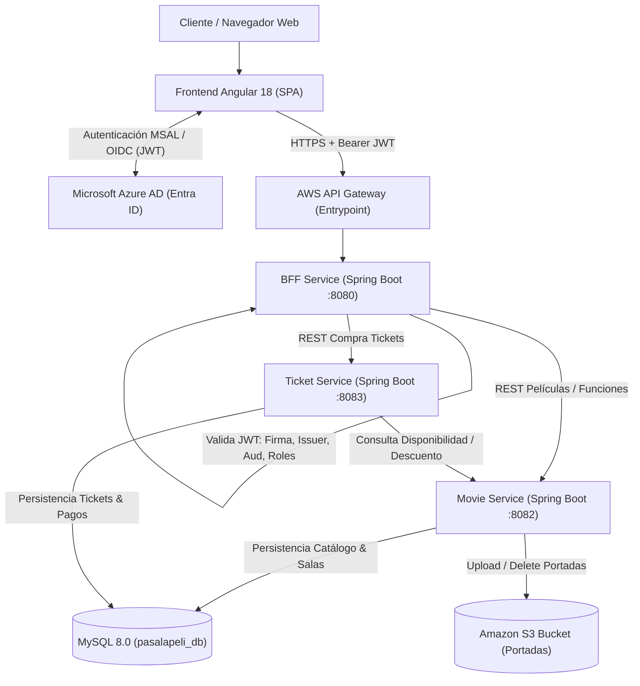

# 🧠 DOCUMENTO DE CONTEXTO TÉCNICO Y ARQUITECTURA (AI & DEVELOPER CONTEXT)
## PROYECTO: "PASA LA PELI" - PLATAFORMA CLOUD NATIVE DE CINE
*Este archivo está diseñado para ser leído por agentes de Inteligencia Artificial (Antigravity, LLMs, Copilots) y desarrolladores humanos para comprender de forma inmediata el estado, arquitectura, componentes y decisiones de diseño del proyecto.*

---

## 1. INFORMACIÓN GENERAL DEL PROYECTO
- **Nombre del Sistema:** Pasa La Peli
- **Asignatura:** Desarrollo Cloud Native I (Sigla: DSY1107)
- **Institución:** Duoc UC
- **Estudiantes / Autores:** Vicente Banderas, Martin Vergara
- **Evaluación:** Evaluación Parcial N° 1 (EP1) - Ponderación 16%
- **Ubicación del Código:** `D:\Pasa La Peli\Github\`
- **Material de Referencia Original:**
  - `Guias/EP1_DSY1107_Estudiante_encargo.pdf` (Pauta de evaluación oficial Duoc UC)
  - `Guias/Informe desarrollo cloud native.docx` (Informe técnico de diseño)
  - `Diagramas/` (7 diagramas arquitectónicos y de secuencia en formato PNG)

---

## 2. ARQUITECTURA GLOBAL Y MULTI-CLOUD

La plataforma utiliza una arquitectura distribuida de microservicios sobre **Microsoft Azure** y **Amazon Web Services (AWS)**:



---

## 3. MAPEO DE MICROSERVICIOS Y PUERTOS

| Componente | Carpeta | Tecnología | Puerto | Responsabilidad Principal |
| :--- | :--- | :--- | :---: | :--- |
| **Frontend** | `frontend/` | Angular 18, MSAL Browser/Angular | `4200` (dev) / `80` (prod) | Interfaz de usuario, cartelera, selección de horarios, modal de compra con manejo de HTTP 409, panel de administración con subida de archivos, e integración MSAL. |
| **BFF Service** | `bff-service/` | Java 21, Spring Boot 3.3, Spring Security OAuth2 | `8080` | Valida técnicamente el JWT (firma JWKS, vigencia, emisor, audiencia, roles) y expone APIs agregadas hacia el frontend. |
| **Movie Service**| `movie-service/`| Java 21, Spring Boot 3.3, Spring Data JPA, AWS SDK v2 | `8082` | Gestión de `Pelicula` y `Funcion`. Sube portadas a Amazon S3 (`/peliculas/<uuid>.jpg`). Control de concurrencia pesimista en cupos. |
| **Ticket Service**| `ticket-service/`| Java 21, Spring Boot 3.3, Spring Data JPA | `8083` | Orquestador del flujo de compra: valida stock en tiempo real con Movie Service, procesa pago simulado (`Pago`), emite `Ticket`, descuenta stock y retorna **HTTP 409 Conflict** si no hay cupos. |
| **Base de Datos**| `database/` | MySQL 8.0 (`pasalapeli_db`) | `3306` | Persistencia relacional de 5 tablas (`Usuario`, `Pelicula`, `Funcion`, `Ticket`, `Pago`). Script inicial: `database/init.sql`. |

---

## 4. ESQUEMA DE BASE DE DATOS (`pasalapeli_db`)

El modelo cumple con `Diagramas/Diagrama BDD.png`:

1. **`Usuario`**:
   - `id`: BIGINT PK AUTO_INCREMENT
   - `nombre`: VARCHAR(100)
   - `correo`: VARCHAR(100) UNIQUE
   - `password`: VARCHAR(255)
   - `rol`: ENUM('ADMIN', 'CLIENTE')

2. **`Pelicula`**:
   - `id`: BIGINT PK AUTO_INCREMENT
   - `titulo`: VARCHAR(100)
   - `descripcion`: TEXT
   - `genero`: VARCHAR(50)
   - `duracion`: INT (minutos)
   - `clasificacion`: VARCHAR(10)
   - `imagen`: VARCHAR(255) (URL de Amazon S3 o fallback local)

3. **`Funcion`**:
   - `id`: BIGINT PK AUTO_INCREMENT
   - `fecha`: DATE
   - `hora`: TIME
   - `sala`: VARCHAR(20)
   - `entradas_disponibles`: INT
   - `precio`: DECIMAL(10,2)
   - `pelicula_id`: BIGINT FK -> `Pelicula(id)` (ON DELETE CASCADE)

4. **`Ticket`**:
   - `id`: BIGINT PK AUTO_INCREMENT
   - `fecha_compra`: DATETIME
   - `codigo`: VARCHAR(100) UNIQUE (ej. `PLP-2026-XXXX`)
   - `estado`: ENUM('PENDIENTE', 'PAGADO', 'CANCELADO')
   - `usuario_id`: BIGINT FK -> `Usuario(id)`
   - `funcion_id`: BIGINT FK -> `Funcion(id)`

5. **`Pago`**:
   - `id`: BIGINT PK AUTO_INCREMENT
   - `monto`: DECIMAL(10,2)
   - `metodo`: VARCHAR(30) (ej. 'WEBPAY', 'TARJETA_CREDITO')
   - `estado`: ENUM('PENDIENTE', 'APROBADO', 'RECHAZADO')
   - `fecha_pago`: DATETIME
   - `ticket_id`: BIGINT FK -> `Ticket(id)` (ON DELETE CASCADE)

---

## 5. FLUJOS DE NEGOCIO CLAVE IMPLEMENTADOS

### Flujo 1: Autenticación con Azure AD y Validación en BFF (Diagrama Auth.png)
1. Angular utiliza la librería `@azure/msal-browser` y `@azure/msal-angular` para autenticar al usuario contra Microsoft Entra ID (Azure AD).
2. Se obtiene un token JWT válido.
3. El `MsalInterceptor` inyecta automáticamente la cabecera `Authorization: Bearer <JWT>` en las peticiones hacia el BFF / API Gateway.
4. El **BFF** valida de forma estricta:
   - **Issuer:** Verifica que el emisor sea el inquilino configurado (`azure.activedirectory.tenant-id`).
   - **Audience:** La clase `AudienceValidator` valida que el `aud` del token coincida con el Client ID o App ID URI registrado.
   - **Firma criptográfica:** Consulta el endpoint JWKS público de Microsoft (`/discovery/v2.0/keys`).
   - **Vigencia:** Valida expiración y marcas temporales con `JwtTimestampValidator`.
   - **Roles y Scopes:** La clase `JwtAuthConverter` extrae los claims `roles` o `scp` para asignar permisos `ROLE_ADMIN` o `ROLE_CLIENTE`.
   - *Modo Desarrollo:* Se incluye `DevMockAuthFilter` que permite simular la identidad mediante cabeceras `X-Dev-User-Role` y `X-Dev-User-Email` cuando no se dispone de una suscripción activa de Azure AD.

### Flujo 2: Compra y Validación de Tickets con HTTP 409 (Diagarma Tickets.png)
1. El usuario selecciona una película y una función en Angular.
2. Angular llama a `POST /api/tickets/comprar` enviando `usuarioId`, `funcionId`, `cantidad` y `metodoPago`.
3. El **BFF** reenvía la petición al **Ticket Service**.
4. El **Ticket Service** consulta a **Movie Service** (`GET /api/funciones/{id}/disponibilidad`).
5. **Evaluación de Disponibilidad:**
   - **Caso Positivo (Hay cupo):** 
     - Se descuenta el stock en Movie Service (`PUT /api/funciones/{id}/descontar`) usando bloqueo pesimista `SELECT ... FOR UPDATE`.
     - Se crea el registro `Ticket` con código único y estado `PAGADO`.
     - Se simula y almacena la transacción en la tabla `Pago` con estado `APROBADO`.
     - Se retorna el ticket digital al cliente con HTTP 201 Created.
   - **Caso Negativo (Sin cupo):**
     - Se lanza `InsufficientTicketsException`.
     - El `GlobalExceptionHandler` intercepta la excepción y retorna un código de error **HTTP 409 Conflict** (según rúbrica oficial de la evaluación).
     - El frontend muestra una alerta visual destacando el conflicto 409 y ofreciendo recargar la cartelera.

### Flujo 3: Carga de Portadas a Amazon S3 (Diagrama específico de S3.png)
1. El administrador accede a `/admin` en Angular.
2. Completa el formulario de película y adjunta el archivo de imagen de la portada.
3. Se envía mediante `multipart/form-data` al endpoint `/api/admin/movies` del BFF, el cual lo canaliza a Movie Service.
4. `S3StorageService` utiliza el cliente de AWS SDK v2 (`S3Client`) para ejecutar un `PutObjectRequest` hacia el bucket de Amazon S3 (`pasalapeli-portadas`).
5. Si las credenciales de AWS no están activadas (`aws.s3.enabled: false`), se activa automáticamente el mecanismo de respaldo local guardando la imagen en `uploads/peliculas` y exponiéndola como recurso estático HTTP sin que la aplicación falle.
6. La URL pública devuelta se almacena en el campo `imagen` de la tabla `Pelicula`.

---

## 6. INVENTARIO COMPLETO DE ARCHIVOS CREADOS

### Base de Datos (`Github/database/`)
- `init.sql`: Creación del esquema `pasalapeli_db`, tablas con llaves foráneas, índices y datos iniciales de prueba (usuarios, películas, funciones, tickets y pagos).

### Movie Service (`Github/movie-service/`)
- `pom.xml`: Dependencias Spring Web, Data JPA, MySQL Connector, Validation, AWS SDK v2 S3, Lombok.
- `src/main/resources/application.yml`: Configuración de base de datos, puerto 8082, propiedades S3 y almacenamiento local.
- `.gitignore`: Ignora `target/`, carpetas de IDE y `uploads/`.
- `Dockerfile`: Compilación y empaquetado contenedor multi-stage en Java 21 Alpine.
- `src/main/java/com/pasalapeli/movie/`:
  - `MovieServiceApplication.java`: Clase principal Spring Boot.
  - `entity/Pelicula.java` & `entity/Funcion.java`: Entidades JPA mapeadas a las tablas MySQL.
  - `dto/`: `PeliculaDTO.java`, `PeliculaRequestDTO.java`, `FuncionDTO.java`, `FuncionRequestDTO.java`, `DisponibilidadDTO.java`.
  - `repository/PeliculaRepository.java` & `FuncionRepository.java`: Consultas JPQL y bloqueo pesimista `findByIdForUpdate`.
  - `config/AwsS3Config.java`: Configuración del cliente `S3Client` de AWS SDK v2.
  - `config/WebMvcConfig.java`: Configuración de CORS y mapeo estático de `/uploads/**`.
  - `service/S3StorageService.java`: Subida y eliminación en Amazon S3 con fallback local seguro.
  - `service/PeliculaService.java`: CRUD de películas y gestión de portadas.
  - `service/FuncionService.java`: Programación de funciones, consulta de stock y descuento atómico.
  - `controller/PeliculaController.java` (`/api/movies`): Endpoints de películas y subida de archivos.
  - `controller/FuncionController.java` (`/api/funciones`): Endpoints de funciones y disponibilidad.
  - `exception/`: `ResourceNotFoundException.java`, `InsufficientTicketsException.java` (409 Conflict), `ErrorResponse.java`, `GlobalExceptionHandler.java`.
  - `test/MovieServiceApplicationTests.java`: Pruebas de contexto.

### Ticket Service (`Github/ticket-service/`)
- `pom.xml`: Dependencias Spring Web, Data JPA, MySQL Connector, Validation, Lombok.
- `src/main/resources/application.yml`: Configuración de base de datos, puerto 8083 y URL de `movie-service`.
- `.gitignore`: Ignora compilados y artefactos.
- `Dockerfile`: Contenedor Java 21 Alpine.
- `src/main/java/com/pasalapeli/ticket/`:
  - `TicketServiceApplication.java`: Clase principal Spring Boot.
  - `entity/`: `Usuario.java`, `Ticket.java`, `Pago.java`, `EstadoTicket.java`, `EstadoPago.java`, `RolUsuario.java`.
  - `dto/`: `ComprarTicketRequestDTO.java`, `TicketResponseDTO.java`, `PagoDTO.java`, `DisponibilidadResponseDTO.java`.
  - `repository/`: `TicketRepository.java`, `PagoRepository.java`, `UsuarioRepository.java`.
  - `config/RestClientConfig.java`: Configuración de `RestTemplate` con timeouts de red.
  - `client/MovieServiceClient.java`: Cliente HTTP REST para consultar y descontar cupos en `movie-service`.
  - `service/TicketService.java`: Lógica de compra transaccional, simulación de pago, emisión de código y descuento de inventario.
  - `controller/TicketController.java` (`/api/tickets`): Endpoints `/comprar`, `/{id}`, `/codigo/{codigo}`, `/usuario/{usuarioId}`.
  - `exception/`: `ResourceNotFoundException.java`, `InsufficientTicketsException.java`, `ErrorResponse.java`, `GlobalExceptionHandler.java`.
  - `test/TicketServiceApplicationTests.java`: Pruebas de integración base.

### BFF Service (`Github/bff-service/`)
- `pom.xml`: Dependencias Spring Web, Spring Security, OAuth2 Resource Server, Validation, Lombok.
- `src/main/resources/application.yml`: Puerto 8080, endpoints de Azure AD y downstream de microservicios.
- `.gitignore`: Reglas de exclusión estándar.
- `Dockerfile`: Contenedor Java 21 Alpine.
- `src/main/java/com/pasalapeli/bff/`:
  - `BffServiceApplication.java`: Punto de entrada del microservicio orquestador.
  - `config/AudienceValidator.java`: Validador de claim `aud` para Azure AD.
  - `config/JwtAuthConverter.java`: Mapeador de claims `roles` y `scp` a `GrantedAuthority`.
  - `config/DevMockAuthFilter.java`: Filtro de soporte para testing y emulación de identidades.
  - `config/SecurityConfig.java`: Configuración de `SecurityFilterChain`, `JwtDecoder` con Nimbus, rutas públicas y protegidas.
  - `config/WebClientConfig.java`: Configuración de `RestTemplate` para llamadas proxy.
  - `dto/UserProfileDTO.java`: DTO de perfil autenticado.
  - `client/MovieClient.java`: Proxy de llamadas al catálogo de películas.
  - `client/TicketClient.java`: Proxy de transacciones de compra de tickets.
  - `controller/AuthController.java` (`/api/auth`): `/me` y `/login-info`.
  - `controller/CarteleraBffController.java` (`/api/cartelera`): Catálogo público de películas y funciones.
  - `controller/TicketBffController.java` (`/api/tickets`): Compra y consulta de tickets autenticados.
  - `controller/AdminBffController.java` (`/api/admin`): Creación de películas, carga de portadas (S3) y funciones bajo rol ADMIN.
  - `exception/GlobalExceptionHandler.java`: Manejo centralizado de respuestas de error.

### Frontend Angular (`Github/frontend/`)
- `package.json`: Angular 18, `@azure/msal-browser`, `@azure/msal-angular`, TypeScript 5.5.
- `angular.json`, `tsconfig.json`, `tsconfig.app.json`: Configuración de compilación moderna.
- `.gitignore`: Ignora `node_modules/`, `dist/`, `.angular/cache/`.
- `Dockerfile` & `nginx.conf`: Despliegue listo para producción con Nginx como servidor estático y reverse-proxy.
- `src/index.html` & `src/styles.css`: Maquetación estética temática de cine oscuro con colores rojo carmesí, dorado y azul cian.
- `src/environments/`: `environment.ts` y `environment.prod.ts` con parámetros para Azure AD y APIs.
- `src/app/`:
  - `services/msal.config.ts`: Factorías de configuración para `MSALInstance`, `MsalGuard` y `MsalInterceptor`.
  - `services/auth.service.ts`: Servicio unificado de autenticación con soporte para Azure AD y switch local de roles Demo.
  - `services/cartelera.service.ts`: Cliente de consumo de cartelera.
  - `services/ticket.service.ts`: Cliente de compra de tickets.
  - `services/admin.service.ts`: Cliente de administración y envío multipart de imágenes a S3.
  - `guards/auth.guard.ts` & `guards/admin.guard.ts`: Protección de rutas en el cliente.
  - `components/navbar/`: Barra de navegación con logo, menú, botón de Azure AD, badge de usuario y selector de roles demo.
  - `components/cartelera/`: Vista principal de películas en cartelera con buscador en vivo y fichas de estreno.
  - `components/pelicula-detalle/`: Vista detallada de película, horarios, salas y cupos en tiempo real.
  - `components/compra-ticket/`: Modal reactivo de selección de entradas, cálculo de precio, simulación de pago, manejo visual de **HTTP 409 Conflict** y emisión de ticket digital con código de barras simulado.
  - `components/mis-tickets/`: Historial de entradas compradas por el usuario autenticado.
  - `components/admin/`: Panel de gestión con formulario de carga de portada a Amazon S3 y programación de funciones en sala.
  - `app.component.*`, `app.routes.ts`, `app.config.ts`, `main.ts`: Estructura principal Standalone de Angular 18.

### Raíz del Repositorio (`Github/`)
- `docker-compose.yml`: Orquestación de MySQL 8.0, Movie Service, Ticket Service, BFF y Frontend.
- `README.md`: Documentación de instalación y guía de evaluación.
- `.gitignore`: Reglas de exclusión globales.
- `PROJECT_CONTEXT.md`: Este documento maestro de contexto.

---

## 7. CÓMO EJECUTAR EL PROYECTO

### Ejecución Todo-en-Uno (Docker Compose):
```bash
cd "D:\Pasa La Peli\Github"
docker compose up --build
```
- **Frontend:** `http://localhost:80`
- **BFF:** `http://localhost:8080`
- **Movie Service:** `http://localhost:8082`
- **Ticket Service:** `http://localhost:8083`
- **MySQL:** `localhost:3306` (Usuario: `root`, Password: `root`, DB: `pasalapeli_db`)

### Ejecución en Modo Local / Desarrollo:
1. **Base de Datos:** Importar `database/init.sql` en MySQL.
2. **Movie Service:** `cd movie-service && mvn spring-boot:run`
3. **Ticket Service:** `cd ticket-service && mvn spring-boot:run`
4. **BFF Service:** `cd bff-service && mvn spring-boot:run`
5. **Frontend:** `cd frontend && npm install && npm start` -> Abrir `http://localhost:4200`

---

## 8. INSTRUCCIONES PARA AGENTES DE IA FUTUROS
- Al agregar nuevas funcionalidades, **respeta los límites de dominio de cada microservicio**. No mezcles la lógica de pagos o tickets dentro de `movie-service`, ni la lógica de películas en `ticket-service`.
- Mantén siempre el retorno explícito del código **HTTP 409 Conflict** en `ticket-service` y en el `GlobalExceptionHandler` cuando se intenten comprar más entradas de las disponibles. Es un criterio crítico evaluado en la rúbrica.
- Cuando habilites Azure AD en producción, actualiza los valores `enabled: true`, `clientId` y `tenantId` en `frontend/src/environments/environment.ts` y en `bff-service/src/main/resources/application.yml`.
- Para cualquier duda o requerimiento técnico adicional, consulta este documento (`PROJECT_CONTEXT.md`) y el archivo de especificación oficial en `Guias/Informe desarrollo cloud native.docx`.
